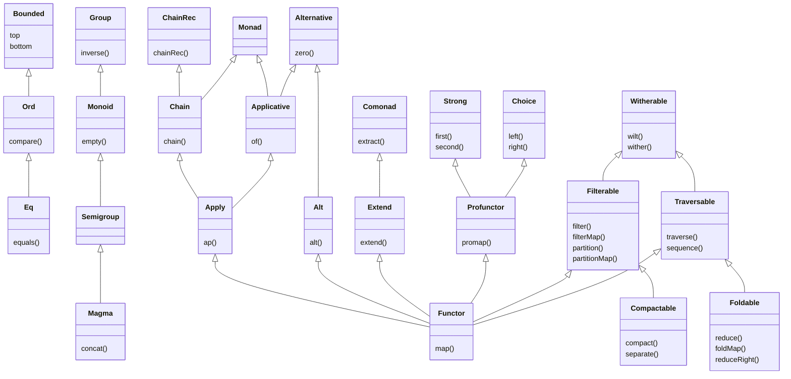

# Diagram

```mermaid
  classDiagram
    Ord <|-- Eq
    Group <|-- Monoid
    Chain <|-- Apply
    ChainRec <|-- Chain
    Monad <|-- Applicative
    Monad <|-- Chain
    Alternative <|-- Alt
    Alternative <|-- Applicative
    Semigroup <|-- Magma
    Apply <|-- Functor
    Alt <|-- Functor
    Bounded <|-- Ord
    Applicative <|-- Apply
    Monoid <|-- Semigroup
    Strong <|-- Profunctor
    Choice <|-- Profunctor
    Comonad <|-- Extend
    Extend <|-- Functor
    Profunctor <|-- Functor
    Filterable <|-- Functor
    Filterable <|-- Compactable
    Traversable <|-- Functor
    Traversable <|-- Foldable
    Witherable <|-- Filterable
    Witherable <|-- Traversable

    class Alt {
      alt()
    }

    class Alternative {
      zero()
    }

    class Applicative {
      of()
    }

    class Apply {
      ap()
    }

    class Bounded {
      top
      bottom
    }

    class ChainRec {
      chainRec()
    }

    class Chain {
      chain()
    }

    class Choice {
      left()
      right()
    }

    class Comonad {
      extract()
    }

    class Compactable {
      compact()
      separate()
    }

    class Eq {
      equals()
    }

    class Extend {
      extend()
    }

    class Filterable {
      filter()
      filterMap()
      partition()
      partitionMap()
    }

    class Foldable {
      reduce()
      foldMap()
      reduceRight()
    }

    class Functor {
      map()
    }

    class Group {
      inverse()
    }

    class Magma {
      concat()
    }

    class Monad {
    }

    class Monoid {
      empty()
    }

    class Ord {
      compare()
    }

    class Profunctor {
      promap()
    }

    class Semigroup {

    }

    class Strong {
      first()
      second()
    }

    class Traversable {
      traverse()
      sequence()
    }

    class Witherable {
      wilt()
      wither()
    }
```
